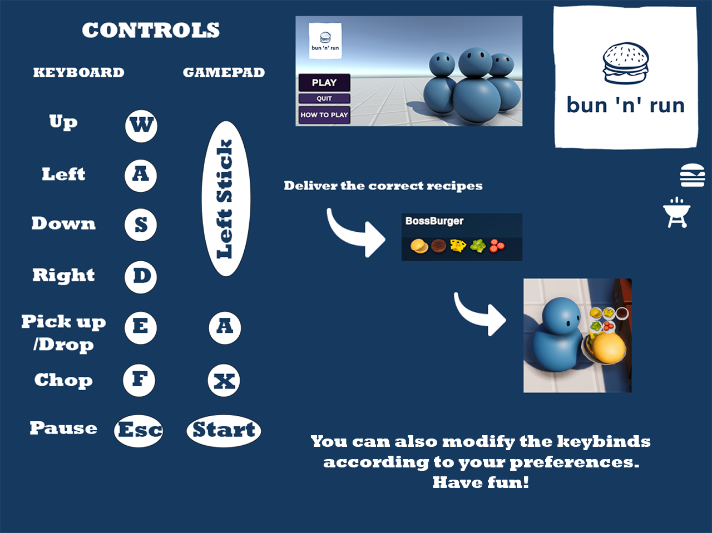

# Bun 'n' Run 🍔

##### _By Anastasia Magopoulou_

```
The «Bun 'n' Run» is a 3D game that was developed for the class "Multimedia Technology" using the Unity platform.
```

> This game is inspired by "Overcooked 2".

<details>
<summary> How to play </summary>
<ul><li> The goal of this game is to deliver as many correct orders as possible. </li></ul>



</details>
<br/>
#### There are four(4) full recipes 🫓:

1. **Burger**: Bun, Patty
2. **Cheeseburger**: Bun, Cheese, Patty
3. **Boss Burger**: Bun, Cheese, Cabbage, Tomato, Cheese, Patty
4. **Salad**: Cabbage, Tomato

#### Your kitchen contains :

- counters with plates,
- clear counters to put the plates in order to prepare the recipe,
- cutting counters to cut the vegetables and cheese for your burgers,
- stoves to cook the patty,
- trash bins for the wrong recipes,
- and the delivery counter!
